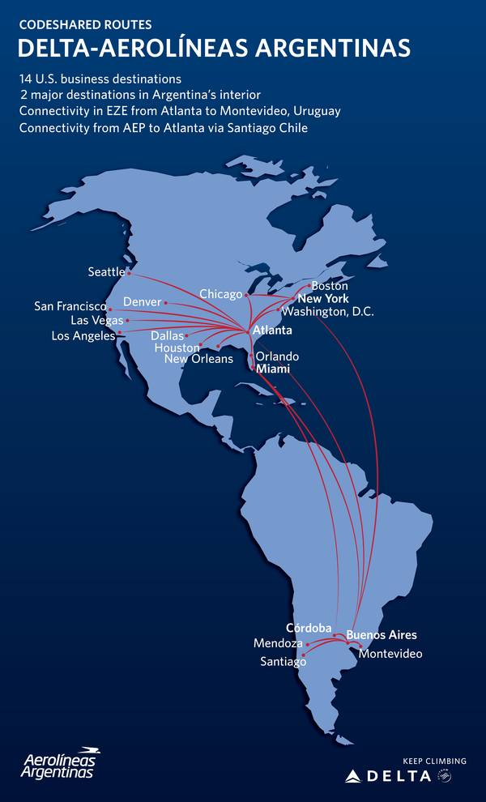

```{r include = FALSE}
knitr::opts_chunk$set(tidy = FALSE, warning=FALSE, message=FALSE)
options(scipen = 15)
```


En la [parte I](https://bitsandbricks.github.io/post/visualizando-con-r-el-historial-de-ubicaciones-de-google-parte-i/), vimos cómo descargar, limpiar y comenzar a visualizar los datos de nuestra ubicación que Google guarda cuando usamos servicios de la compañía. 

En la [parteII], XXX.

En esta entrega final, vamos a visualizar los vuelos con los que el usuario conectó las ciudades por dode estuvo. 

Para reproducir los resultados ,recomiendo correr antes el código de la [parte I](https://bitsandbricks.github.io/post/visualizando-con-r-el-historial-de-ubicaciones-de-google-parte-i/), que deja preparados los sets de datos que vamos a utilizar aquí.

## Identificando vuelos

Durante los ejercicios anteriores, notamos que los datos contienen ubicaciones registradas a ambos lados del Atlántico. A no ser que nuestro viajero haya optado por largos viajes en barco, podemos estar seguros de que ha tomado varios aviones. ¿Cómo podemos detectar los destinos unidos mediante vuelos?

Tras experimentar con varios métodos, me encontré con que la forma más simple es buscar registros de ubicación consecutivos separados por más de 250 Km. Tomando ventaja de la prohibición de usar las antenas del celular durante el vuelo, asumimos que si alguien recorrió un largo trecho desde su última conexión a GPS ha estado a bordo de una aeronave. Hay que aclarar que este criterio podría producir falsos positivos en caso de que el usuario haya viajado en auto por larguísimos trechos con su celular apagado (y falsos negativos en el caso de tramos en avión muy breves). 

A continuación necesitamos traducir a metros la distancias entre geo-coordenadas. Podriamos escribir una función que aplique la [fórmula del haversine](https://es.wikipedia.org/wiki/F%C3%B3rmula_del_haversine), o haciendo gala de una saludable pereza, usar la que viene incluida en el paquete `geosphere`:

```{r}
library(tidyverse)
library(geosphere)

# Cargamos el dataset con el historial de ubicaciones, obtenido en  # https://bitsandbricks.github.io/post/visualizando-con-r-el-historial-de-ubicaciones-de-google-parte-i/

locationdf <- read.csv('/home/havb/data/Google/Location History/locationdf.csv', 
                       stringsAsFactors = F)
class(locationdf$date) <- 'POSIXct'

# La funcion distGeo toma dos listas con sets de coordenadas, 
# y devuelve la distancia en m
distance <- distGeo(locationdf[-nrow(locationdf), c("lat", "lon")], 
                      locationdf[-1, c("lat", "lon")])

# Unimos los datos de distancia con el dataset de ubicaciones
# Descartamos la primera fila del dataset de ubicaciones, ya que al no registrarse 
# una posición previa, no permite calcular distancia recorrida

locationdf <- cbind(locationdf[-1,], distance)

# Agregamos un indice al dataframe, que nos va a servir luego 
# para encontrar el origen de los viajes

locationdf <- cbind(index = 1:nrow(locationdf), locationdf)

# Extraemos los destinos de los vuelos (arrivos a más de 250 KM del último registro)
flights <- locationdf %>% 
  select(index, lat, lon, date, year, CITY_NAME, CNTRY_NAME, distance) %>% 
  filter(distance > 250000) 

# Agregamos el lugar de salida de los vuelos

findOrigin <- function(index) {
  return(data.frame(prev_lat = locationdf[locationdf$index == index-1, "lat"],
                    prev_lon = locationdf[locationdf$index == index-1, "lon"],
                    prev_city = locationdf[locationdf$index == index-1, "CITY_NAME"])
         )
}

# Finalmente, nuestra lista de vuelos
flights <- cbind(flights, map_df(flights$index, findOrigin))


```

La lista de vuelos encontrados luce así: 

```{r}
library(DT)
datatable(flights, options = list(dom = 'tip'), rownames = F,
          caption = 'Vuelos encontrados en el historial')
```

Transformar la lista en una visualización es simple; sólo trazamos sobre un mapamundi las lineas que conectan orígenes y destinos:

```{r}
library(mapdata)

maps::map("world", col="#f2f2f2", fill=TRUE, bg="white", lwd=0.15)#, xlim=xlim, ylim=ylim)

points(bind_rows(flights[, c("lon", "lat")], 
             flights[, c("prev_lon", "lat")]), 
       col = "red")

lines(bind_rows(flights[, c("lon", "lat")], 
             flights[, c("prev_lon", "lat")]), 
      col = "orange", lwd=2)
title( main = ":/")


```

Simple si, pero esas líneas rectas quedan bastante raras. Dado que nuestro planeta es un esferoide, si proyectamos sobre un plano la distancia más corta entre dos puntos, la línea resultante no es una recta. Por ejemplo, así es como Delta Airlines muestra los vuelos que brinda en sociedad con Aerolíneas Argentinas:



Para reproducir esas curvas sobre el globo terráqueo, que llevan el simpático nombre de [ortodrómicas](https://es.wikipedia.org/wiki/Ortodr%C3%B3mica), volvemos a recurrir al paquete `geosphere`:

```{r}
curvas <- gcIntermediate(flights[c("lon", "lat")], 
                         flights[c("prev_lon", "prev_lat")])

maps::map("world", col="#f2f2f2", fill=TRUE, bg="white", lwd=0.15)#, xlim=xlim, ylim=ylim)

points(bind_rows(flights[, c("lon", "lat")], 
             flights[, c("prev_lon", "lat")]), 
       col = "red")

for(i in 1:length(curvas)){
  lines(curvas[[i]], col = "orange", lwd=2)
}

title( main = ":)")

```


# Inflando el globo

Por último, hagamos una proyección esférica. De paso podemos mostrar más información, como el año en que se efectuó cada vuelo, o la cantidad de veces que se pasó por un destino. Para ello, necesitamos (como siempre!) preparar nuestros datos.


```{r}
# Generamos las coordenadas de las curvas/trayectos

curvas <- gcIntermediate(flights[,c('prev_lon', 'prev_lat')], 
                           flights[,c('lon', 'lat')], 
                           100, addStartEnd=TRUE, sp=TRUE)

# Convertimos las curvas (que son un "spatial object") en una lista de dataframes que vamos a poder plotear

curvas <- map_df(curvas@lines, fortify)

# Agregamos la data de los vuelos

flights$index <- 1:nrow(flights)

curvas <- merge(curvas, flights, by.x = "id", by.y = "index", all.x = T)

# Acomodamos los datos de las ciudades para agregarlas a la visuaizacion
# Unimos las ciudades, sean origen o destino, en una sola lista

ciudades <- bind_rows(flights[c("lat", "lon", "CITY_NAME")] %>% 
                        setNames(c("lat", "lon", "ciudad")),
                      flights[c("prev_lat", "prev_lon", "prev_city")] %>% 
                        setNames(c("lat", "lon", "ciudad")))


ciudades <- ciudades %>%
  # Las coordenadas de las ciudades difieren enre registros, debido a difrentes 
  # posiciones exactas del usuario. Lo arreglamos...
  aggregate(data = ., cbind(lon, lat) ~ ciudad, FUN = function(x) mean(range(x))) %>% 
  # Agregamos frecuencia de visitas
  left_join(count(ciudades, ciudad)) 

```

Ahora si, generemos la visualización. Indicamos el año del vuelo mediante su color, y la cantidad de veces que el usuario pasó por una ciudad mediante el tamaño del punto que la representa.

```{r}
## Un globo terráqueo
library(hrbrthemes)
library(ggrepel)
ggplot() +
  borders("world", colour="gray80", fill="gray95") +
  # Graficamos los trayectos, diferenciando por año 
  geom_path(data = curvas, 
            aes(long, lat.x , 
                group = group, 
                color = as.factor(year)),
            size = 1.6,
            alpha = .85) +
  scale_color_brewer(palette = "YlGn") +
  # Agregamos las ciudades
  geom_point(data=ciudades, aes(x = lon, y = lat, size = n), 
             shape = 16, alpha = .5) +
  # y etiquetas con los nombres
  geom_label_repel(data = ciudades, 
            aes(lon, lat, label = ciudad, angle = 10, 
                group = NULL), 
            size = 3) +
  # Centramos la proyección en el Océano Atlántico
  coord_map("ortho", orientation = c(10, -40, 0)) +
  labs(y = "", x = "",
       title="Historial de ubicaciones de Google",
       subtitle="vuelos detectados",
       color = "Año",
       size = "Frecuencia") +
  theme_ipsum() 
```

No luce nada mal. 

Para terminar, una simple conclusión: Google sabe demasiado sobre sus usuarios. Sería bueno pensar en como podemos remediarlo. No me refiero a "volver atrás" y dejar de usar tecnologías como el GPS y los registros de ubicación, sino a encontrar la forma de tomar control de nuestros datos, y tener el derecho a saber que se hace con ellos, limitando los usos que no nos convenzan.
